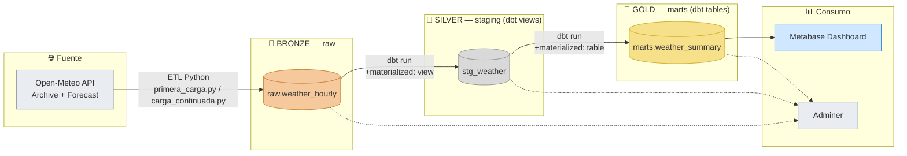

# 🌤️ Weather Data Stack — Medallion Architecture

Stack de datos end-to-end para ingestar, transformar y visualizar datos meteorológicos de varias ciudades españolas, usando **arquitectura Medallion (Bronze → Silver → Gold)** sobre PostgreSQL, orquestado con Docker Compose.

> Fuente de datos: [Open-Meteo API](https://open-meteo.com/) (histórico + forecast)
> Ciudades monitorizadas: **Madrid, Salamanca y Barcelona**

---

## 🏅 Arquitectura Medallion

El corazón del proyecto es un pipeline de datos organizado en tres capas, cada una con su responsabilidad clara — el patrón estándar de **Bronze / Silver / Gold**:



| Capa | Nombre técnico | Materialización | Contenido |
|---|---|---|---|
| 🥉 **Bronze** | `raw.weather_hourly` | Tabla física (Postgres) | Datos crudos tal cual llegan de Open-Meteo, sin transformar |
| 🥈 **Silver** | `staging.stg_weather` | **View** (dbt) | Limpieza, tipado y normalización de columnas |
| 🥇 **Gold** | `marts.weather_summary` | **Table** (dbt) | Datos listos para negocio/BI, agregados y modelados |

Este enfoque desacopla la ingesta (siempre aditiva y sin transformar) de la lógica de negocio (versionada en SQL/dbt), permite reprocesar capas superiores sin volver a golpear la API externa, y deja trazabilidad completa de cada dato desde su origen.

---

## 🧱 Stack tecnológico

| Servicio | Imagen / Build | Rol | Puerto |
|---|---|---|---|
| **db** | `postgres:16` | Motor de base de datos (todas las capas) | `5432` |
| **etl** | build `./etl` | Jobs Python de ingesta (carga inicial + incremental) | — |
| **dbt** | build `./dbt_project` | Transformaciones Silver/Gold + docs | `8081` |
| **airflow** | build `./airflow` | Orquestación de los jobs *(en progreso)* | `8082` |
| **adminer** | `adminer:latest` | Cliente web ligero para explorar Postgres | `8080` |
| **metabase** | `metabase/metabase:latest` | Dashboards y BI sobre la capa Gold | `8083` |

---

## 📥 Ingesta (capa Bronze)

Dos jobs Python independientes, pensados para ejecutarse como *Job 1* y *Job 2*:

- **`primera_carga.py`** → carga histórica inicial contra `archive-api.open-meteo.com` (por defecto, últimos `INITIAL_LOAD_DAYS=7` días).
- **`carga_continuada.py`** → carga incremental contra `api.open-meteo.com/v1/forecast`, pensada para ejecutarse periódicamente (el disparo periódico lo gestiona el orquestador, Airflow).

Ambos insertan en `raw.weather_hourly` con `ON CONFLICT (city, observed_at) DO NOTHING`, por lo que son **idempotentes**.

Ciudades configuradas en `config.py`:

```python
CITIES = [
    {"name": "Madrid",    "lat": 40.4168, "lon": -3.7038},
    {"name": "Salamanca", "lat": 40.9701, "lon": -5.6635},
    {"name": "Barcelona", "lat": 41.3874, "lon": 2.1686},
]
```

---

## 🔧 Transformación (capas Silver/Gold — dbt)

`dbt_project.yml` define la materialización por capa:

```yaml
models:
  weather_project:
    staging:
      +materialized: view
      +schema: staging
    marts:
      +materialized: table
      +schema: marts
```

El `entrypoint.sh` del contenedor `dbt` ejecuta, en orden:

1. `dbt run` → construye Silver (views) y Gold (tables)
2. `dbt docs generate` → genera documentación del proyecto
3. `dbt docs serve` → expone la documentación interactiva en `:8081`

---

## 📊 Visualización — Metabase

Panel construido sobre la capa **Gold** (`marts`), con KPIs por ciudad, evolución de temperatura, humedad relativa y distribución de condiciones meteorológicas.


> ⚠️ Esta imagen es un **mockup ilustrativo** generado para el README (no es una captura real de la instancia de Metabase). Sustitúyela por una captura real de tu dashboard en `http://localhost:8083` una vez tengas los charts montados.

---

## 🚀 Cómo levantar el stack

```bash
git clone <este-repo>
cd <este-repo>
docker compose up -d --build
```

| Servicio | URL |
|---|---|
| Adminer | http://localhost:8080 |
| dbt docs | http://localhost:8081 |
| Airflow | http://localhost:8082 |
| Metabase | http://localhost:8083 |

Credenciales por defecto de Postgres (ver `docker-compose.yml`, cámbialas antes de producción):

```
usuario: stack_user
password: stack_pass
db: stack_db
```

---

## 📂 Estructura del repo (resumen)

```
.
├── docker-compose.yml
├── etl/
│   ├── Dockerfile
│   ├── entrypoint.sh
│   ├── config.py
│   ├── db.py
│   ├── primera_carga.py
│   ├── carga_continuada.py
│   └── requirements.txt
├── dbt_project/
│   ├── dbt_project.yml
│   ├── profiles.yml
│   └── entrypoint.sh
└── airflow/
    └── dags/
```

---

## 🛠️ Roadmap / TODO

- [ ] Definir DAGs de Airflow para orquestar `carga_continuada.py` cada `LOAD_INTERVAL_MINUTES`
- [ ] Añadir tests de dbt (`not_null`, `unique`, `accepted_values` en `weathercode`)
- [ ] Sustituir el mockup de Metabase por una captura real
- [ ] Variables de entorno en `.env` (sacar credenciales del `docker-compose.yml`)
